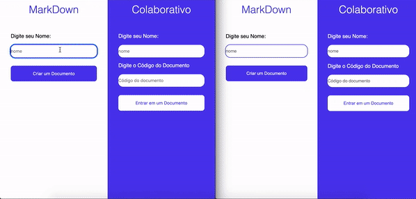

## Markdown Colaborativo
consiste em um editor de markdown onde usuarios interagem e podem editar documentos simultaneamente


## 🕹️ Tecnologias Utilizadas
- [React Native](https://reactjs.org)
- [Typescript](https://www.typescriptlang.org)
- [Sass](https://sass-lang.com/)
- [Yarn](https://yarnpkg.com/)
- [NodeJS](https://reactjs.org)
- [Typescript](https://www.typescriptlang.org)
- [Express](http://expressjs.com/pt-br/)
- [Socket.IO](https://socket.io/)
- [Mongodb](https://www.mongodb.com/)
- [Docker](https://www.docker.com)
- [Git](https://git-scm.com)

## Como executar


### Precisa ter instalado na maquina:
- [NodeJs](https://nodejs.org/en/)
- [Docker Desktop](https://www.docker.com/get-started/)
- [VSCode](https://code.visualstudio.com)
- [Yarn](https://classic.yarnpkg.com/lang/en/docs/install/#mac-stable)

Para installar o yarn abrar cmd como administrador e digite:

```bash
npm install --global yarn
```
Clone o projeto com:
``` bash
git clone https://github.com/felipebaloneker/markdown-colaborated.git
```
### Crie o banco de dados com Docker
instale o docker composer na sua maquina, abra o vscode na pasta do projeto e execute o seguinte script no terminal:

```bash
#criar mongodb

docker-compose up -d
```
ele cria um banco mongodb apartir do arquivo 'docker-compose.yml' na raiz do projeto.

### Dependências e Inicialização:
Primeiro precisamos iniciar o servidor. Abra o terminal do  Vscode e digite o seguinte comando:
``` bash
# abrir pasta server
cd server

# instalar depenências
yarn install

# iniciar 
yarn dev
```
Após esse processo o servidor será iniciado em: http://localhost:4000

Agora iniciaremos o nosso cliente web. Abrar uma nova aba No terminal e digite o seguinte comando:
```bash
# abrir pasta client
cd client
# instalar depenências
yarn install

# iniciar 
yarn start
```
Agora podemos abrir o prejto no navegador em: http://localhost:3000
